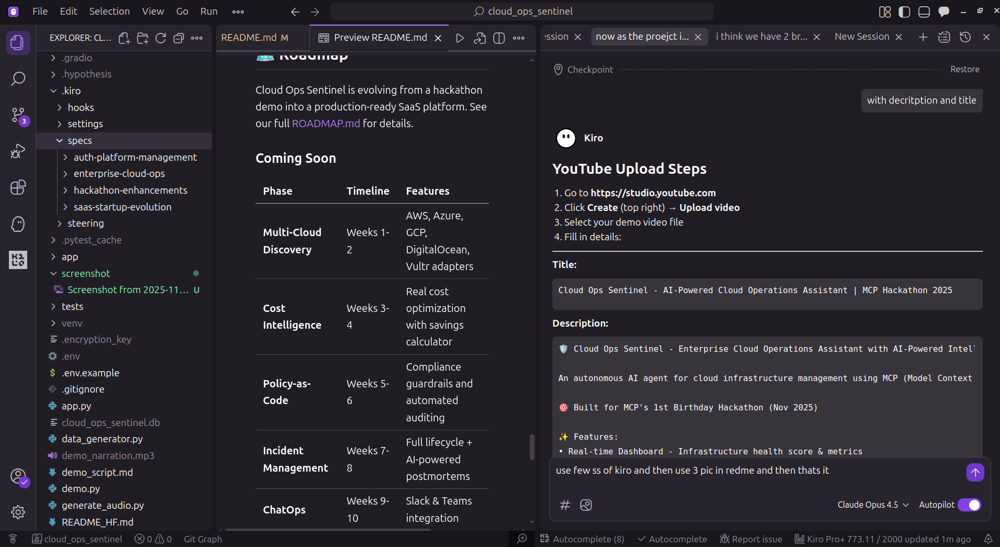

# ☁️ Cloud Ops Sentinel

**AI-Powered Cloud Operations Assistant** - Enterprise-grade infrastructure monitoring, anomaly detection, cost optimization, and automated remediation.

## 🏆 AWS Global Vibe: AI Coding Hackathon 2025

This project was built using **Amazon Kiro IDE** for the AWS Global Vibe Hackathon.

### 🛠️ Built with Amazon Kiro

Cloud Ops Sentinel was developed entirely using **Amazon Kiro IDE**, leveraging its AI-powered coding capabilities:

- **Spec-Driven Development** - Used Kiro's spec workflow to define requirements, design, and implementation tasks
- **Agentic Code Generation** - Kiro's AI agent helped generate boilerplate, implement features, and debug issues
- **Intelligent Code Completion** - AI-assisted coding for faster development
- **Automated Testing** - Property-based tests generated with Kiro's assistance

> 📸 See [Kiro Usage Screenshots](#kiro-usage-screenshots) below for proof of tool integration.

## � DNemo Video
## 📹 Demo Video
[](https://youtu.be/HK8jU1KIRrU)

**Watch the full demo:** https://youtu.be/HK8jU1KIRrU

## 📱 Social Media

[](https://x.com/ashwinhegde19/status/1995111001101054123)

**X/Twitter:** https://x.com/ashwinhegde19/status/1995111001101054123

## 👥 Team

- **Ashwin Hegde** - [GitHub](https://github.com/Ashwinhegde19) | [HuggingFace](https://huggingface.co/ashwinredmi)
- **Akshay Joshi** - [GitHub](https://github.com/doozie-akshay) | [HuggingFace](https://huggingface.co/akshayjoshi999)

> 💪 **Note:** Although ElevenLabs credits were not available to us, we still produced a polished demo video with AI-generated narration.


## 🎯 One-liner Pitch

> AI-powered cloud operations assistant that detects idle instances, forecasts costs, detects anomalies with embeddings, and provides LLM-generated ops reports through MCP tools.

## ✨ Features

### Core Features
- 📊 **Real-time Dashboard** - Infrastructure health score, instance counts, daily costs
- 🚫 **Idle Resource Detection** - Find underutilized instances with savings calculator
- 💰 **Cost Forecasting** - Predict future costs with confidence intervals
- 🔍 **Anomaly Detection** - AI-powered service health analysis
- 🔄 **Service Control** - Restart services via Modal/Blaxel backends
- 📋 **AI Ops Reports** - LLM-generated infrastructure analysis with recommendations

### 🆕 Advanced Features (Hackathon Enhancements)
- 💬 **Ops Chat** - Natural language interface that auto-calls MCP tools ("Show me idle instances", "Restart svc_web")
- 🤖 **Auto-Remediation** - Autonomous anomaly detection → restart → verify → report loop
- 🏥 **Hygiene Score** - Single 0-100 score measuring overall infrastructure health with weighted factors
- 📥 **PDF/Markdown Reports** - Downloadable reports with SambaNova-generated narratives

## 🚀 Quick Start

### Prerequisites

| Requirement | Version | Check Command |
|-------------|---------|---------------|
| Python | 3.8+ | `python3 --version` |
| pip | Latest | `pip --version` |
| Git | Any | `git --version` |

### Option 1: One-Command Start (Recommended)

```bash
# Clone the repository
git clone https://github.com/yourusername/cloud-ops-sentinel.git
cd cloud-ops-sentinel

# Linux/Mac
chmod +x start.sh
./start.sh

# Windows
start.bat
```

### Option 2: Manual Setup

```bash
# Clone and enter directory
git clone https://github.com/yourusername/cloud-ops-sentinel.git
cd cloud-ops-sentinel

# Create virtual environment
python3 -m venv venv

# Activate virtual environment
source venv/bin/activate        # Linux/Mac
# venv\Scripts\activate         # Windows

# Install dependencies
pip install -r requirements.txt

# Copy environment file (optional - works without API keys)
cp .env.example .env

# Start the application
python app.py
```

### Option 3: Using uv (Fast Package Manager)

```bash
# Install uv if not installed
pip install uv

# Clone and setup
git clone https://github.com/yourusername/cloud-ops-sentinel.git
cd cloud-ops-sentinel

# Create venv and install deps (much faster)
uv venv venv
source venv/bin/activate
uv pip install -r requirements.txt

# Run
python app.py
```

### Access the Dashboard

Open your browser to: **http://localhost:7860**

### Running Tests

```bash
# Activate virtual environment first
source venv/bin/activate

# Run all tests
pytest tests/ -v

# Run with coverage
pytest tests/ --cov=app --cov-report=html

# Run property-based tests only
pytest tests/ -v -k "property"
```

## 🔧 Configuration

### Environment Variables

Copy `.env.example` to `.env` and configure your API keys:

| Variable | Purpose | Get Key At |
|----------|---------|------------|
| `SAMBANOVA_API_KEY` | Primary LLM for AI reports | https://sambanova.ai |
| `HF_API_KEY` | Fallback LLM + UI hosting | https://huggingface.co/settings/tokens |
| `MODAL_API_TOKEN` | Compute jobs & restarts | https://modal.com/settings |
| `HYPERBOLIC_API_KEY` | Vector embeddings | https://hyperbolic.xyz |
| `BLAXEL_API_KEY` | Alternative compute | https://blaxel.ai |

**Note:** All integrations are optional. The app runs in simulation mode without API keys.

## 🛠️ MCP Tools

Cloud Ops Sentinel exposes 6 core tools via Model Context Protocol:

| Tool | Description |
|------|-------------|
| `list_idle_instances` | Detect idle VMs/containers with cost savings |
| `get_billing_forecast` | Predict monthly costs with confidence |
| `get_metrics` | Get service performance metrics |
| `detect_anomaly` | AI-powered anomaly detection |
| `restart_service` | Restart via Modal or Blaxel |
| `summarize_infra` | LLM-generated ops report |

## 🤖 AI Integrations

### SambaNova (Primary LLM)
- Model: Meta-Llama-3.1-8B-Instruct
- Used for: Ops reports, executive summaries, recommendations

### Hyperbolic (Embeddings)
- Used for: Log analysis, anomaly pattern detection

### LangChain (Orchestration)
- Used for: Multi-step workflows, tool chaining

## 📁 Project Structure

```
cloud-ops-sentinel/
├── app/
│   ├── ui_gradio.py        # Gradio 6 web interface
│   ├── mcp_server.py       # MCP tools implementation
│   ├── llm_client.py       # SambaNova/HF LLM integration
│   ├── orchestrator.py     # LangChain workflows
│   ├── hyperbolic_client.py# Anomaly detection
│   ├── modal_client.py     # Modal compute
│   ├── blaxel_client.py    # Blaxel compute
│   ├── infra_simulation.py # Synthetic data generation
│   ├── models.py           # Pydantic data models
│   ├── config.py           # Configuration management
│   ├── ops_chat.py         # 🆕 Natural language chat agent
│   ├── auto_remediate.py   # 🆕 Auto-remediation engine
│   ├── hygiene_score.py    # 🆕 Infrastructure hygiene scoring
│   └── pdf_report.py       # 🆕 PDF/Markdown report generation
├── .env.example            # Environment template
├── requirements.txt        # Python dependencies
├── start.sh               # Quick start script (Linux/Mac)
├── start.bat              # Quick start script (Windows)
└── README.md              # This file
```

## 🧪 Testing Tools

```bash
# Test all MCP tools
python demo.py --all

# Test specific tool
python demo.py --tool idle
python demo.py --tool forecast
python demo.py --tool metrics
python demo.py --tool anomaly
python demo.py --tool restart
python demo.py --tool report
```

## 🌐 Deploy to Hugging Face Spaces

1. Create a new Space at https://huggingface.co/spaces
2. Choose **Gradio** as the SDK
3. Upload all project files
4. Set environment variables in Space settings
5. The app will auto-deploy from `app/ui_gradio.py`

## 🏆 Sponsor Integrations

This project integrates with hackathon sponsors:

- 🚀 **Modal** - Serverless compute for service restarts
- 🔮 **Hyperbolic** - Vector embeddings for anomaly detection
- ⚡ **Blaxel** - Alternative compute backend
- 🤗 **Hugging Face** - Gradio UI hosting + fallback LLM
- 🧠 **SambaNova** - Primary LLM for AI-powered reports
- 🔗 **LangChain** - Workflow orchestration
- 🔌 **MCP** - Model Context Protocol tools

## ⚠️ Current Limitations

We believe in transparency. Here's what Cloud Ops Sentinel can and cannot do today:

| Limitation | Current State | Planned Solution |
|------------|---------------|------------------|
| **Simulated Infrastructure** | Uses synthetic data for demo purposes | Multi-cloud adapters (AWS, Azure, GCP) in Phase 1 |
| **No Persistent Storage** | Data resets on restart | PostgreSQL integration for production |
| **Single-User Mode** | No authentication or multi-tenancy | SSO + RBAC in Phase 6 |
| **No Real Cost Data** | Cost forecasts are simulated | Cost Explorer API integration in Phase 2 |
| **Limited Anomaly Detection** | Rule-based with LLM enhancement | ML-based detection with historical learning |
| **No External Alerting** | Alerts only in UI | Slack/Teams/PagerDuty webhooks in Phase 5 |

### What Works Well Today
- ✅ Full MCP tool integration with 6 operational tools
- ✅ LLM-powered natural language operations (Ops Chat)
- ✅ Autonomous remediation loop with health verification
- ✅ Infrastructure hygiene scoring with actionable suggestions
- ✅ PDF/Markdown report generation with AI narratives
- ✅ Graceful fallbacks when API keys are unavailable

## 🗺️ Roadmap

Cloud Ops Sentinel is evolving from a hackathon demo into a production-ready SaaS platform. See our full [ROADMAP.md](ROADMAP.md) for details.

### Coming Soon

| Phase | Timeline | Features |
|-------|----------|----------|
| **Multi-Cloud Discovery** | Weeks 1-2 | AWS, Azure, GCP, DigitalOcean, Vultr adapters |
| **Cost Intelligence** | Weeks 3-4 | Real cost optimization with savings calculator |
| **Policy-as-Code** | Weeks 5-6 | Compliance guardrails and automated auditing |
| **Incident Management** | Weeks 7-8 | Full lifecycle + AI-powered postmortems |
| **ChatOps** | Weeks 9-10 | Slack & Teams integration |
| **Enterprise Polish** | Weeks 11-12 | SSO, RBAC, unified dashboard |

### Future Vision
- Cloud Drift Detection (Terraform/Pulumi state comparison)
- Secret Scanner (API keys, tokens in logs/storage)
- Plugin Marketplace for custom integrations
- Compliance Reports (ISO 27001, SOC2, GDPR)

## 📸 Kiro Usage Screenshots

Evidence of Amazon Kiro IDE usage during development:

### AI-Assisted Development with Kiro

| Screenshot | Description |
|------------|-------------|
|  | Kiro AI chat assisting with MCP tools development |
|  | Agentic code generation and debugging |
|  | Spec-driven development workflow |

*Screenshots show actual development sessions using Amazon Kiro IDE.*

## 📝 License

MIT License - See [LICENSE](LICENSE) for details.

---

Built with ❤️ using **Amazon Kiro IDE** for the AWS Global Vibe: AI Coding Hackathon 2025
